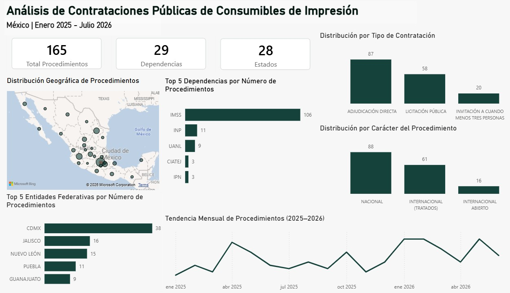

# Análisis de Contrataciones Públicas de Consumibles de Impresión
## Descripción del proyecto

Este proyecto analiza los procedimientos de contratación pública relacionados con consumibles de impresión publicados en ComprasMX, con el objetivo de identificar tendencias, entidades con mayor actividad y características relevantes del mercado gubernamental.

El análisis fue desarrollado utilizando **Power BI y Power Query**, desde la integración y depuración de las bases de datos hasta la construcción de indicadores y visualizaciones para facilitar la interpretación de la información.

## Objetivo

Transformar información pública de contrataciones gubernamentales en datos estructurados y útiles para analizar el comportamiento de las compras de consumibles de impresión en México.

## Herramientas utilizadas
- Power BI
- Power Query
- Excel
- ComprasMX

## Proceso de limpieza y transformación

El conjunto de datos original se obtuvo a partir de información pública disponible en ComprasMX correspondiente al periodo de enero de 2025 a julio de 2026.

### 1. Integración de datos
Se recopilaron 73 archivos en formato Excel y se consolidaron mediante Power Query para generar una única base de datos.

### 2. Limpieza y transformación
Se realizó la revisión y depuración de la información, incluyendo:

- Eliminación de columnas no relevantes para el análisis.
- Corrección y homologación de tipos de datos.
- Tratamiento de valores nulos.
- Homologación de categorías y nombres.
- Validación de fechas.
- Revisión de registros duplicados.

### 3. Identificación de procedimientos relevantes
Se creó una regla de clasificación mediante Power Query para identificar procedimientos relacionados con consumibles de impresión utilizando palabras clave como:

- Tóner
- Cartucho
- 372

Posteriormente se realizó una validación de los resultados para detectar y excluir falsos positivos.

Por ejemplo, algunos procedimientos contenían la palabra "cartucho", pero correspondían a consumibles utilizados en equipos de codificación industrial y no a consumibles de impresión incluidos en el alcance del análisis.

Después del proceso de limpieza, clasificación y validación se obtuvo un conjunto final de **165 procedimientos**, correspondientes a **29 dependencias** y **28 entidades federativas**.

### 4. Análisis y visualización
La información depurada fue utilizada para desarrollar un dashboard en Power BI enfocado en identificar patrones geográficos, institucionales, temporales y de modalidad de contratación.

## Análisis realizado
El dashboard permite analizar aspectos como:
- Entidades federativas con mayor número de procedimientos.
- Dependencias con mayor actividad de contratación.
- Modalidades de contratación utilizadas.
- Distribución de procedimientos por periodo.
- Comparación de tendencias entre diferentes periodos.

## Dashboard

## Fuente de datos

Información pública disponible a través de **ComprasMX**.

## Principales hallazgos

- Dentro del conjunto de datos analizado, el **Instituto Mexicano del Seguro Social (IMSS)** es la dependencia con mayor número de procedimientos relacionados con la adquisición de tóner y consumibles de impresión.

- Las entidades federativas con mayor número de procedimientos identificados son **Ciudad de México, Jalisco y Nuevo León**, mostrando una mayor concentración de oportunidades de contratación en estas entidades.

- Al analizar específicamente los procedimientos publicados por el **IMSS**, se observa que la **Licitación Pública** es la modalidad de contratación utilizada con mayor frecuencia.

- En el análisis general, predominan los procedimientos de **carácter nacional**. Desde una perspectiva comercial, esta información puede utilizarse para evaluar la compatibilidad del origen de las marcas comercializadas con los requisitos de participación e identificar procedimientos internacionales que puedan representar nuevas oportunidades de negocio.

- En **2025**, abril registró el mayor número de procedimientos. Posteriormente se observa un nuevo incremento hacia los últimos meses del año, que se mantiene hasta febrero de 2026. Durante **2026**, la actividad vuelve a mostrar un incremento en mayo.

## Autor
**Flor De La Rosa Baez**

Proyecto de portafolio de Análisis de Datos y Business Intelligence.
